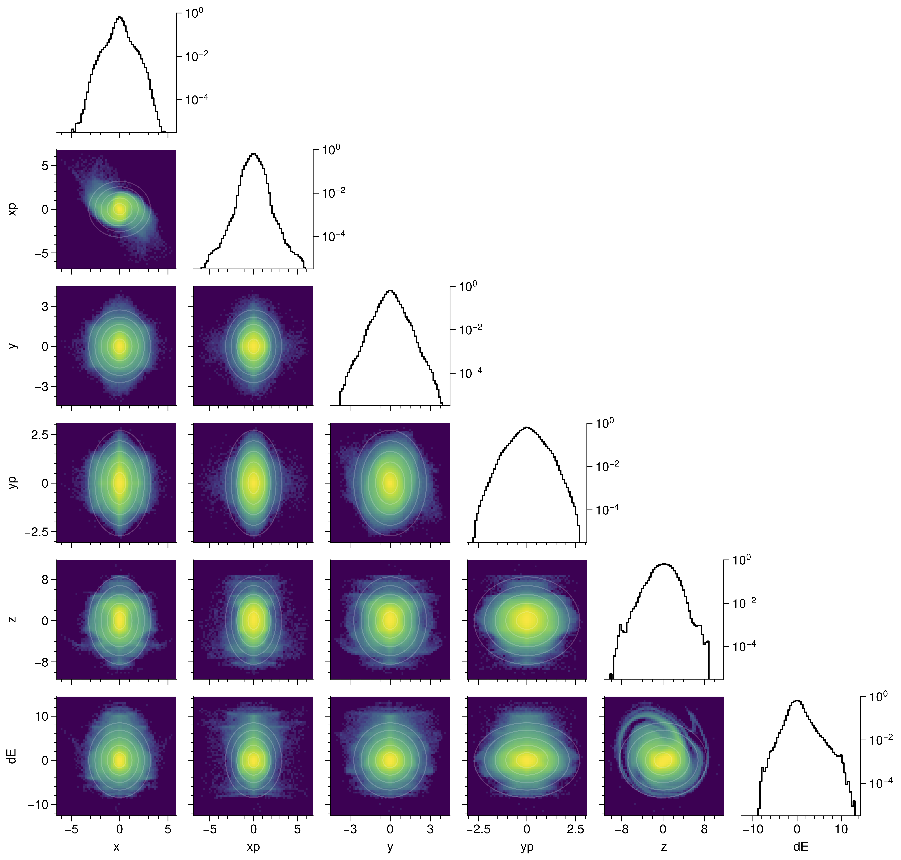

# psdist

This repository is a collection of analysis and visualization methods for six-dimensional position-momentum space (phase space) distributions. Most of the methods should work for point-cloud or image data of any dimensionality.

## Installation

https://pypi.org/project/psdist/

## Examples

Some examples in accelerator physics that use methods from this repository:
* https://journals.aps.org/prab/abstract/10.1103/PhysRevAccelBeams.23.124201
* https://arxiv.org/abs/2301.04178

### Slice matrix
Slice matrix plots represent four-dimensional data. The main figures shows a four-dimensional slice of a measured five-dimensional phase space distribution. Lower dimensional projections are shown on the side panels.

### Shell slices
Shell slices can be used to visualize the dependence of the distribution in a low-dimensional subspace on the radius in some other high-dimensional subspace. The figure below selects "shells" based on four-dimensional density contours in the $x$-$x'$-$y$-$y'$ plane, then plots the distribution along another dimension ($w$) within each shell.

### Corner plot

