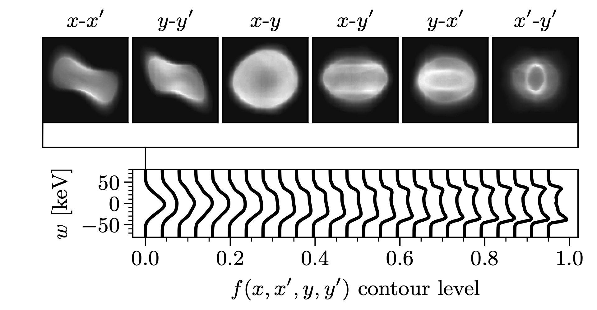

# Gallery

## Slice matrix

The following figure represents a four-dimensional slice of a measured five-dimensional phase space distribution, with lower-dimensional projections shown on the side panels.

## Shell slices
Shell slices can be used to visualize the dependence of the distribution in a low-dimensional subspace on the radius in some other high-dimensional subspace. The figure below selects "shells" based on four-dimensional density contours in the $x$-$x'$-$y$-$y'$ plane, then plots the distribution along another dimension ($w$) within each shell.

## Corner plot

