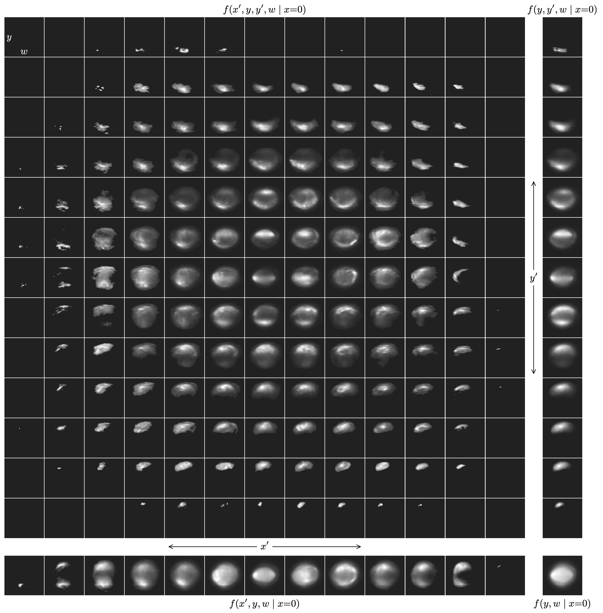

# psdist

This repository is a collection of analysis and visualization methods for six-dimensional position-momentum space (phase space) distributions. Most of the methods should work for point-cloud or image data of any dimensionality.

## Installation

https://pypi.org/project/psdist/

## Examples

Some accelerator physics publications that use methods from this repository:
* https://journals.aps.org/prab/abstract/10.1103/PhysRevAccelBeams.23.124201
* https://arxiv.org/abs/2301.04178

The following figure represents a four-dimensional slice of a measured five-dimensional phase space distribution, with lower-dimensional projections shown on the side panels.

Other example figures are at ...